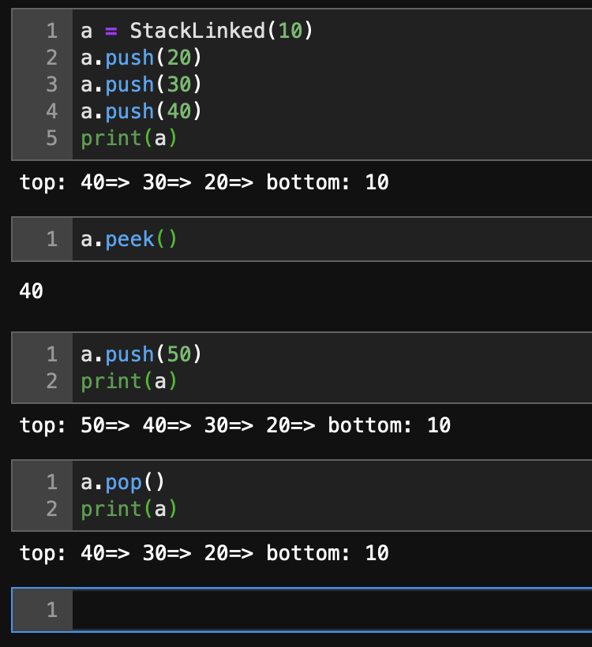
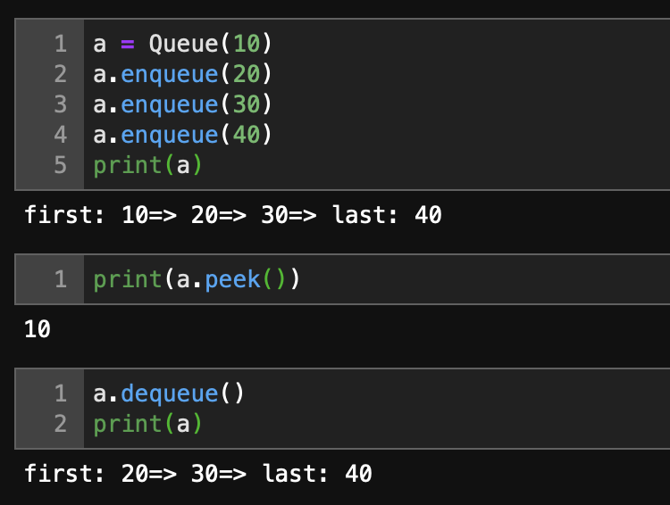

# Stacks and Queues
This is a implementation of Stacks and Queues Data Structure on Python.
On Stacks both Linked List and Array data structure used. Stacks have functionality to push, peek and pop.
Queues have functionality to enqueue, dequeue and peek.
## Stacks

## Queues
